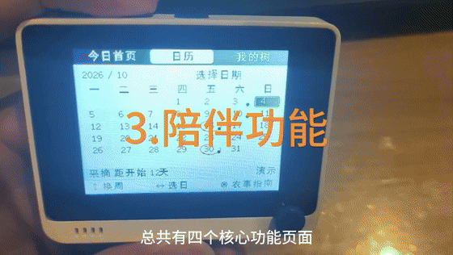

# vibe_pet · 小苹果桌面宠物 🍎

<p align="center">
  <br/>
  <sub>▲ 产品全貌 18 秒速览 · 完整介绍视频见下</sub>
</p>

<p align="center">
  <video src="assets/intro.mp4" controls width="640"></video>
</p>

> ▶ 完整产品介绍视频（3 分 44 秒）：GitHub 等平台可在上方直接播放；Gitee 不支持内嵌视频标签，点[这里](assets/intro.mp4)打开或下载观看。

> 2026-10-03 页面底部已统一为按键图标＋短文字并烧录。日历月份栏按下“调日期”，月份栏和日期区中按均进入“农事指南”。目标检查与有限真机验证见 [FOOTER_ICON_UI.md](FOOTER_ICON_UI.md)。

> 2026-10-03 “生活计时”交互已更新并烧录：上下调整分钟数，左右选择重置或启停，中按执行；选中按钮深绿高亮，隐藏预设时长和自定义行，操作提示独立放在最底部。适用于煮面、泡茶等日常计时。实现与目标验证见 [TIMER_UI_REDESIGN.md](TIMER_UI_REDESIGN.md)。

> 2026-10-03 苹果树设置已实现并烧录：“我的树 → 本次采集设置”改为“苹果树设置”，只读展示当前名字和形象，标注“待开发”，后续通过手机小程序定制。我的树和设置缩略图现已复用首页实际模型并等比缩放。操作与验证见 [TREE_SETTINGS_UI.md](TREE_SETTINGS_UI.md)。

> 2026-10-03 冰箱助手已更新并烧录：直接修改库存，减少量自动累计到“今天已吃”，补货不计入；列表显示苹果和鸡蛋，暂不处理日期。操作与针对性验证见 [FRIDGE_INVENTORY_INTERACTION.md](FRIDGE_INVENTORY_INTERACTION.md)。

> 2026-10-03 月历交互更新：中按先选页面顶部月份栏，左右换月、按下选日；日期区上下按周移动。确认规则、返回层级及实现验证见 [CALENDAR_INTERACTION.md](CALENDAR_INTERACTION.md)。

> 2026-10-03 导航更新：开机进入“今日日历”；PINGPING 互动页移至“我的树 → 陪伴苹果”。操作与验证见 [NAVIGATION_UPDATE.md](NAVIGATION_UPDATE.md)。

> 2026-10-02 当前固件已接入冰箱助手：苹果、桃子、梨、菠菜、胡萝卜和鸡蛋分别记录库存、今日已吃与今日进货，支持数量修正和撤销；原提醒事项已替换。操作与本轮真机记录见 [FRIDGE_HARDWARE.md](FRIDGE_HARDWARE.md)。宠物、树木档案、日历、倒计时及农事流程保留，此前农事版本记录见 [UI_IMPLEMENTATION.md](UI_IMPLEMENTATION.md) 和 [HARDWARE_VERIFICATION.md](HARDWARE_VERIFICATION.md)。

> 2026-10-03 已统一全部日期为北京时间：PINGPING 顶栏、日历、档案和每日记账共用 `ClockSnapshot`，修复凌晨日期相差一天的问题。实现与真机验证见 [CLOCK_FIX.md](CLOCK_FIX.md)。

给 AI 编码代理（Claude Code 等）配一只硬件桌面宠物：代理在“思考 / 干活 /
等批准 / 完成 / 出错”时，Wio Terminal 屏幕上的**小苹果**会做出对应的动画。

> 思路来自 Seeed 官方的 [vibe-pet](https://github.com/Seeed-Solution/vibe-pet)
> 项目（BLE + Petdex 形象库）。本目录是它的精简自研版：小苹果形象 + USB 串口
> 传输。初代 Wio Terminal（SAMD51）没有蓝牙射频，所以 MVP 走串口（就是烧录那
> 根线），协议层保持与官方一致（状态机 + 精灵动画），以后可替换传输层。

## 架构

```
Claude Code hooks ──(stdin JSON)──> hook_event.py ──(UDP 127.0.0.1:9911)──> vibe_pet_host.py ──(USB 串口 COM8)──> Wio Terminal 固件
   UserPromptSubmit -> THINKING                                                        S:THINKING\n              小苹果动画
   PreToolUse        -> TOOL
   PostToolUse       -> THINKING
   Notification      -> WAIT
   Stop              -> DONE
   SessionEnd        -> IDLE
```

- **固件**（`firmware/`）：TFT_eSPI 离屏精灵逐帧画小苹果，解析串口行协议切换
  状态；宿主机静默 2 分钟自动回 IDLE、10 分钟打瞌睡（watchdog 在固件侧，守护
  进程无需发心跳）。没接宿主机时，五向键左右可手动切换状态演示。
- **宿主机**（`host/`）：`vibe_pet_host.py` 守护进程把 UDP 事件转发到串口；
  `hook_event.py` 是 Claude Code Hook 的入口，纯标准库、毫秒级返回。

## 屏幕规格与驱动方式

### Wio Terminal 实体屏幕

开发板使用 Wio Terminal 自带的约 2.4 英寸彩色 TFT LCD，分辨率为 **320×240**。
固件使用 RGB565（16 位颜色）绘图，屏幕底层通信由 `TFT_eSPI` 库和 Wio Terminal
板级配置完成，业务代码不直接操作 SPI 引脚。

固件启动时执行 `tft.begin()` 初始化屏幕，并通过 `tft.setRotation(3)` 设置横屏方向。
页面和宠物动画先绘制到内存中的 `TFT_eSprite` 画布，再通过 `pushSprite()` 一次性提交
到 LCD，减少逐像素刷新造成的闪烁。项目使用一个共享的 `320×240` RGB565 画布，另有
一个较小的宠物区域；页面切换时复用这块内存，避免频繁申请和释放大块缓冲区。

宠物动画不是视频或 GIF，而是固件每一帧实时绘制。主循环读取当前状态和 `millis()`
时间，依次绘制背景、苹果身体、眼睛、嘴巴、手臂以及问号、火花、`Zzz` 等状态效果，
然后把完整画布推送到 LCD。宠物页循环末尾约 `delay(30)`，理论刷新频率约为 30 FPS。
主要绘图函数包括 `drawBody()`、`drawEyes()`、`drawMouth()`、`drawHand()` 和
`drawPet()`。

实体屏幕的驱动链路为：

```
Claude Code 状态
  -> 固件状态变量 gState
  -> drawPet(now) 实时绘图
  -> TFT_eSprite 内存画布
  -> TFT_eSPI
  -> Wio Terminal 内部 SPI
  -> 320×240 LCD
```

### 电脑桌面挂件

`fridge_magnet.py` 是不连接开发板时使用的桌面版。它先在 `160×120` 的软件画布上
绘制像素小苹果，再使用 Pillow 最近邻放大到 `320×240` 的 Tkinter 窗口中；该窗口不
是 Wio Terminal 的实体屏幕，不能替代固件页面和实体按键。

## 状态 ↔ 动画对照

| 代理状态 | 状态字 | 小苹果的表现 |
|---|---|---|
| 空闲/会话结束 | `IDLE` | 站着呼吸，偶尔眨眼 |
| 思考中 | `THINKING` | 眼睛向上看、摸头，头顶冒 "…" |
| 使用工具 | `TOOL` | 快速抖动敲键盘，敲出小火花 |
| 等待批准 | `WAIT` | 上下蹦，头顶大问号，摊手 |
| 已完成 | `DONE` | 跳跃、^ ^ 笑眼、举手撒纸屑 |
| 出错 | `ERROR` | 左右打晃、X X 眼、感叹号 |
| 打瞌睡 | `SLEEP` | 闭眼呼吸，飘 Zzz |

## 快速开始

### 1. 刷固件

```bash
cd vibe_pet/firmware
pio run -t upload          # COM8，与 wio/ 工程共用
```

### 2. 起守护进程

```bash
cd vibe_pet/host
pip install -r requirements.txt   # 仅 pyserial
python vibe_pet_host.py           # 默认 COM8；--port COMx 可改
```

### 3.（可选）先不接 Claude，用模拟器看效果

```bash
python simulate.py               # 循环播放一轮工作状态
```

### 4. 接入 Claude Code

把 `hooks/settings.snippet.json` 里的 `hooks` 字段合并进
`~/.claude/settings.json`。之后每次对话，小苹果就会跟着状态动起来。

## 冰箱贴模式（桌面挂件，无需开发板）

不想插板子？`fridge_magnet.py` 是一块贴在桌面上的像素小苹果挂件：
无边框、置顶、可拖动，直接监听 UDP 9911 收 Claude Code hooks 的真实事件
（没有事件时自动演示轮播，右上角小绿点亮 = 收到过真实联动）。

```bash
python fridge_magnet.py                # 纯桌面挂件
python fridge_magnet.py --serial COM8  # 挂件 + 转发状态给 Wio Terminal
```

> 注意：冰箱贴和 `vibe_pet_host.py` 都监听 9911 端口，二选一运行；
> 要同时驱动真机就用 `--serial`，由冰箱贴转发。

操作：左键按住拖动；右键菜单可关自动演示、取消置顶、退出。

## 串口协议（115200，行式，`\n` 结尾）

| 报文 | 说明 |
|---|---|
| `S:IDLE\|THINKING\|TOOL\|WAIT\|DONE\|ERROR\|SLEEP` | 切换状态，固件回 `OK:<STATE>` |
| `T:<n>` | Token 计数，显示在底栏右上角 |
| `P` | 心跳，喂固件 watchdog，回 `OK:PONG` |

## 目录结构

```
vibe_pet/
├── README.md
├── firmware/            # Wio Terminal 固件（PlatformIO）
│   ├── platformio.ini
│   └── src/vibe_pet.cpp
├── host/                # 宿主机守护进程 + Hook 转发器 + 模拟器
│   ├── vibe_pet_host.py
│   ├── hook_event.py
│   ├── simulate.py
│   └── requirements.txt
└── hooks/
    └── settings.snippet.json   # 合并进 ~/.claude/settings.json
```

## 后续可玩的方向

- **换形象**：把 `drawBody/drawEyes/drawMouth` 换成 Petdex 风格的 `pet.json`
  + 精灵图帧，从 SD 卡或 Flash 读位图。
- **BLE**：换带蓝牙的硬件（ESP32-S3 / XIAO nRF52840）或给 Wio Terminal 加
  BLE 模块，`vibe_pet_host.py` 的串口写入换条后端即可。
- **多代理**：UDP 报文里加 agent id，固件分栏显示多只小苹果。
